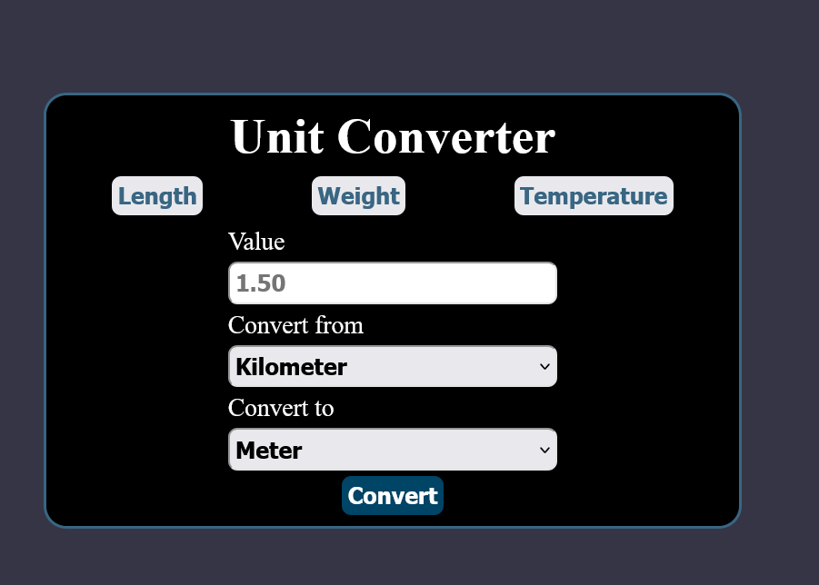
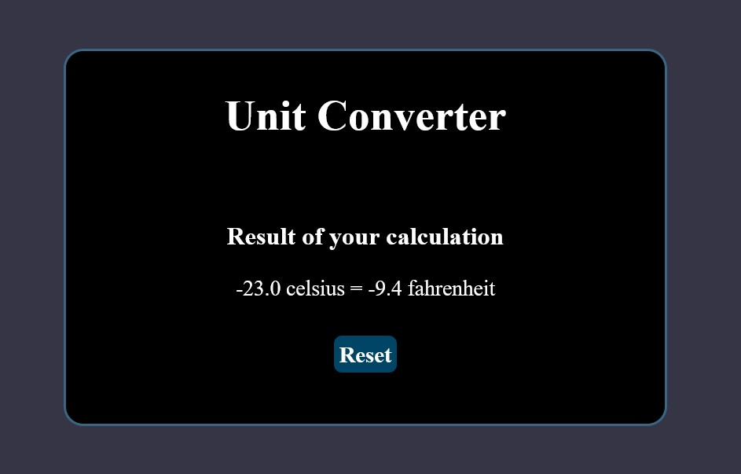

# Unit Converter

A simple web app that can convert between different units of measurement. This project is a solution to [Unit Converted project](https://roadmap.sh/projects/unit-converter) of Backend Project of [roadmap.sh](https://roadmap.sh).







## Units of measurement
- Length: millimeter,centimeter,meter,kilometer,inch,foot,yard,mile.
- Weight: milligram, gram, kilogram, ounce,pound.
- Temperature: Celsius, Fahrenheit, Kelvin.


## Technologies
- Java 17
- Maven
- Spring Boot
- JSP
- Apache Tomcat

## Usage

1. Clone the repository
```
git clone https://github.com/L-ux-es/UnitConverter.git
cd UnitConverter
```
2. Build the project
```
mnv clean install
```
3. Deploy to Tomcat or Spring Boot
 - For Tomcat url should be: `http://localhost:8080/[Application-Context]`
 - For Spring Boot, Spring Boot class should be: `com.example.unitconverter.UnitConverterApplication`
4. Start server
5. Open web browser and navigate to the page:
 - For Tomcat:`http://localhost:8080/[Application-Context]`
 - For Spring Boot: `https://localhost/8080`


